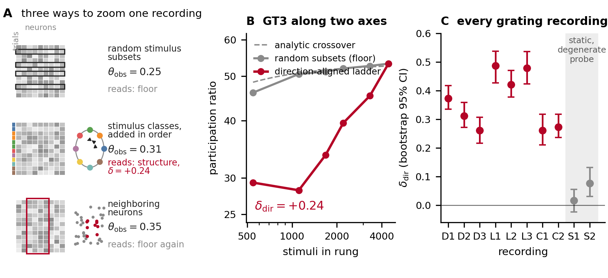
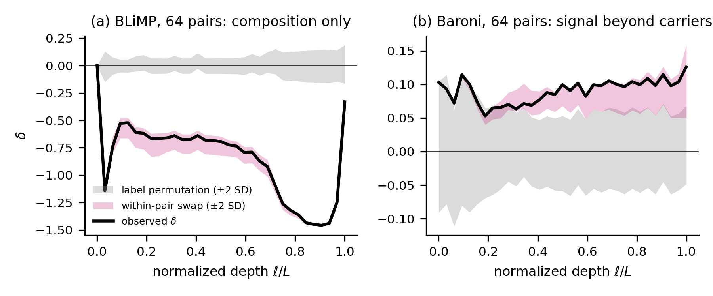

# Structure is in the zoom

**Probing neural symmetry through dimensionality scaling.** Adil Amin, ZEHEN Labs. arXiv 2026
(identifier added on posting). This repository is two things: `rung`, the measurement released as a
tested tool, and the complete code and data behind every number in the paper.

**Neural door.** You have trials x neurons (or frames x neurons) and one label per row. You get the part
of the scaling exponent that label explains, its permutation p-value, and a second null for the nuisance
your labeling preserves.

**LLM door.** You have a Hugging Face model (any checkpoint) and a category set. You get the same three
numbers at every layer from one command, with every prompt in the paper shipped as a runnable axis.

## The tool

A dimensionality scaling exponent (how the participation ratio grows as you add data) is not
a property of a system: on one ten-thousand-neuron patch of mouse V1 it reads 0.25, 0.31, and
0.35 along three probe axes, and the three numbers mean three different things. `rung`
decomposes any such exponent exactly into a **label-blind sampling floor** plus a **shift
delta earned against a declared axis** (the classes you accumulate and the order you add them
in), and tests that shift two ways: against a label-permutation null (Monte Carlo, 500 draws by default), and, when you
tell it what nuisance structure your partition preserves, against a **nuisance-preserving
null** that isolates what the labels add. It runs on any samples-by-features array and on any
Hugging Face language model layer by layer. A rung is one step of the subsampling ladder; the tool
reads every rung against its matched floor. (Released as `theta-zoom` through 1.1.0; `theta_zoom` and the
`theta-zoom` command stay as aliases for one release.)

### Install and run (sixty seconds)

```bash
pip install git+https://github.com/adilamin89/structure-in-the-zoom   # numpy core: rung data / summarize / plot
rung data X.npy labels.npy --out r.json --plot r.png                   # any samples-by-features array
```

For the language-model door clone the repository (the paper's axes live in `axes/`) and add the model extras:

```bash
git clone https://github.com/adilamin89/structure-in-the-zoom && cd structure-in-the-zoom
pip install -e ".[models]"                       # + torch, transformers, datasets
rung llm --model EleutherAI/pythia-160m --axis axes/ --device mps --out pythia160m.json
rung plot pythia160m.json --out pythia160m.png
rung summarize pythia160m.json                 # plain-language reading, the paper's rules applied
```

### What it returns, per layer and per axis

- `delta`, `p_two`: the shift along the declared class order and its permutation p-value
  (Monte Carlo, 500 permutations by default);
- `delta_orderavg`, `p_two_orderavg`: the shift averaged over random class orders, the
  partition-level statistic for unordered classes;
- `strat_p_two` when a strata file exists: the shift against the nuisance-preserving null, the
  difference between "the labels organize this representation" and "the labels happen to
  preserve composition".

`rung plot` draws one panel per axis with both statistics against their null bands.
`rung summarize` applies the paper's reading rules: certification under
Benjamini-Hochberg for both statistics, the declared-path shape (embedding sign, peak, zero
crossing), and, with strata, whether the signal is label-linked or composition.



### Use cases

**A neural recording with labels.** Trials x neurons with a stimulus label per trial
(direction, orientation, category), or frames x neurons with a state label (running speed
octiles, pupil, session-time blocks). Pass the session or animal as strata when trials are not
exchangeable across it.

```python
from rung import zoom
r = zoom(X, labels, n_perm=500)                     # declared order + order-averaged
r = zoom(X, labels, strata=session_ids, n_perm=500) # + nuisance-preserving null
r["delta"], r["p_two"], r["delta_orderavg"], r["p_two_orderavg"], r["strat_p_two"]
```

`rung data X.npy labels.npy --strata strata.npy --out r.json --plot r.png` is the same from
the shell: the JSON carries every statistic plus both ladders (`pr_obs`, `pr_floor`), the PNG is
the ladder figure (observed against the matched floor, shift and p annotated), and
`rung summarize r.json` reads it in plain language (sign, certification at the permutation
resolution, order-averaged agreement, and the stratified verdict when strata were given).

**Your own axis from a public dataset.** Any Hugging Face dataset with a text column and a label
column becomes an axis JSON (and, with `--strata-field`, a nuisance sidecar) in one command:

```bash
rung axis --dataset Rowan/hellaswag --split validation \
  --text-field ctx --label-field activity_label --n-classes 8 --n-per-class 16 --out hs_axis.json
rung llm --model EleutherAI/pythia-160m --axis hs_axis.json --device mps --out hs.json
```

Classes default to the most frequent labels; pass `--classes` to choose them. The same builder is a
Python function, `build_axis(rows, text_field, label_field, ...)`, for records you already hold.

**Blind probes.** A linear participation ratio cannot see past a rogue dimension (paper Sec 8.4, run 55:
OLMo-1B has one feature carrying two thirds of the variance and reads zero on every axis). `rung data` prints
`spectrum()` first (effective dimension, leading-eigenvalue fraction, largest single-feature fraction) and warns
when one dimension dominates; `--standardize` (or `zoom(..., standardize=True)`) z-scores every feature first,
which restores OLMo-1B's content axis. Off by default so `--paper-seeds` reproduces the published cells.

**Tests.** `pip install -e ".[test]" && pytest -q tests` runs the numpy-only suite: the
decomposition identity, certification on structured labels and its absence on shuffled ones, the
stratified null, the command line end to end, and the axis builder.

**A language model, every layer.** Every prompt in the paper ships in `axes/` as a ready-to-run
axis file: the seven battery axes (world-knowledge domains, sentence-construction types, ethical
concepts, TruthfulQA categories, HellaSwag activities, ARC topics, and a random control), the
ETHICS benchmark axis (`ethics_benchmark.json`, four normative domains x 32), and the two planted
C8 axes (`compass.json`, `clock.json`, eight classes x 16 shared carriers). Three strata sidecars
turn on the second null where the paper used it: `language_type.strata.json` (topics) and
`compass.strata.json` / `clock.strata.json` (carrier ids, the carrier-stratified floor of Sec 8.6).
Point `--axis` at the folder or at one file; run any subset, any model, any checkpoint.

**Checkpoint and model sweeps.** Any Hugging Face revision; every JSON has the same shape.

```bash
for r in step1000 step4000 step16000 step64000 step143000; do
  rung llm --model EleutherAI/pythia-410m-deduped --revision $r \
      --axis axes/language_type.json --device mps --out lt_410m_$r.json
done
```

`--paper-seeds` reproduces the paper's Table 5 cells to the last digit (max |CLI - artifact| = 0).

**Any readable site.** `zoom()` takes any samples x features array, so the features can be one
attention head's output, an MLP's neurons, or a sparse autoencoder's latents instead of the residual
stream, and the same axis file can be swept over checkpoints (`--revision`) and post-training stages
(base, SFT, DPO, RLHF) with the floor and both nulls unchanged.

**Your own axes.** An axis is a JSON file `{class_name: [prompt, ...]}`. Six or more classes,
sixteen or more prompts each, prompts within a class coherent in structure and varied in
content. Add `<name>.strata.json` with one nuisance label per prompt (topic, template, carrier,
session) and the tool picks it up.

**Python API.** `llm_battery("EleutherAI/pythia-160m", ["axes/"], device="mps", out_path="b.json")`
runs the whole battery; `zoom(...)` is the core.

### What it shows (the paper in six results)

- **Cortex.** The direction-aligned shift is positive in all eight grating recordings and
  exceeds every one of 200 label permutations (p = 1/201 each); it replicates across 167
  Neuropixels populations from 32 mice in a second laboratory and tracks orientation-tuning
  strength (r = +0.41, mixed model p = 3e-7). Where the declared axis is degenerate the
  instrument screens candidate axes and finds session time, spatial frequency, and behavioral
  state.
- **Symmetry.** The working axis follows the code's approximate O(2) symmetry. The eight-class
  harmonic decomposition of the class-mean correlation is exact; full-field gratings are
  quadrupole-dominant (orientation), localized gratings dipole-dominant (direction) because
  single neurons become more direction-selective, and the balance is additive over neurons,
  invariant under random coarse-graining, and steered by label-aware coarse-graining
  (orientation-sorted blocks amplify the quadrupole: the Z2 quotient at the mesoscale). The
  blocking factor B(K) = [1/K + (1-1/K) rho2] / [1/K + (1-1/K) rho1] makes that quantitative; mouse
  anatomy sits at its random limit (registered run 51).
- **Ground truth.** Ising and nematic lattices and a rotation-equivariant CNN fix the sign:
  conditioning on a scalar order parameter removes dimensions, accumulating a group orbit adds
  them, architectural invariance gives exactly zero; the measured harmonics predicted the
  network's ordering in advance at two of three depths.
- **Language models.** Across seven model families, including a state-space model (Mamba-2.8B on the Pile, the fifth corpus-by-architecture cell), the instrument separates content axes
  inherited from tokens from construction axes built along the declared path; label linkage
  is certified at nearly every depth under the order-free statistic, while the profile shape
  belongs to the class arrangement. A pre-registered alignment probe fails informatively:
  instruction tuning does not measurably reorganize moral-category covariance at 0.5-1B on two
  taxonomies. The kernel-harmonic additivity and the blocking flow replicate on Pythia-160m's
  planted axes; a prepended neutral context does not move them.
- **Two null levels.** A nonzero shift means the partition changes covariance accumulation
  relative to its declared null; reading it as representation of the label needs a null that
  preserves nuisance composition. On BLiMP minimal pairs a |z| near 20 vanished under that null.
- **Predictions.** A size ladder at fixed contrast should move the dipole/quadrupole balance
  monotonically; mesoscale signals in orientation-columnar cortex should be
  quadrupole-amplified relative to their single units, cortex with direction maps should keep
  the mesoscale dipole.



### Using it right

1. **Declare before you look.** Classes, class count, and accumulation order are fixed first.
2. **Six or more classes.** Two-class designs fit a slope through two points.
3. **For unordered classes, read the order-averaged shift.** The declared-path profile is a
   property of one path through the classes.
4. **Pass your nuisance structure as strata.** If the shift survives the within-stratum
   permutation, the label is doing work.
5. **Counts are descriptive; profile statistics are inferential.** Expect about 1.7 false
   positives per 33 uncorrected layers.
6. **Coherence beats prompt count.** Prompts that widen within-class topic diversity weaken
   structural axes.

### Extending it

Everything the paper measures goes through one function, `zoom(X, labels, strata=None)`, and the pieces
you would change are small and named.

- **A new null.** The two shipped nulls are label permutation and permutation within `strata`. A null is
  a rule for relabeling at fixed rung sizes, so a third one is a loop that draws relabelings and re-runs
  the observed ladder against the shared floor. The circular-shift null for time-series labels (the
  paper's spontaneous sessions, Section 3) is written out in `scripts_canonical/run40_spont_state_axis.py`
  and is the template.
- **A nonlinear estimator.** `zoom()` builds one Gram matrix and every rung is `_subset_pr(K, idx)`, the
  centered Gram-trace participation ratio of that subset. A kernel PR is the same call on a kernel matrix;
  a local intrinsic dimension (TwoNN, MLE) replaces `_subset_pr` with a function of the subset rows. The
  identity theta_obs = theta_floor + delta holds for any functional evaluated on both arms; the paper's
  sign rule and ordering results have been checked for the linear estimator only (Limitations).
- **Other modalities.** `rung data` reads `.npy`, `.csv`, and whitespace text through `_load_array`. For
  NWB files build the trials x units count matrix with `pynwb` and save it as `.npy`; for `.mat`,
  `scipy.io.loadmat`. A vision model is the LLM door with a different encoder: collect one feature vector
  per image at each layer (forward hooks) and call `zoom(X, labels)` per layer, passing the image-level
  nuisance (template, scene, photographer) as `strata`.
- **Multi-token probes.** `llm_battery` reads the last-token hidden state (`h[0, -1, :]`). Mean over a
  span, or a specific token position, is a one-line change there; the paper's mean-pooling result
  (Section 8.2: the construction axis collapses, the content axis survives) is the reference point.
- **Checkpoints and revisions.** `--revision` takes any Hugging Face revision, so `rung llm` over a
  training run is a shell loop (above).

Tests are numpy-only and run in ten seconds (`pytest -q tests`); add one per extension.

## What is where

```
rung.py                  the instrument: zoom(), llm_battery(), build_axis(), and the rung CLI
                         (data | llm | axis | plot | summarize); numpy core, optional torch+transformers
theta_zoom.py            alias of rung (the name through 1.1.0), kept for one release
tests/                   numpy-only pytest suite (pytest -q tests)
render_all.py            prints the paper's tables and headline numbers from the artifacts
axes/                    every prompt in the paper: 7 battery axes + ETHICS + compass + clock, with
                         strata sidecars; PROVENANCE.md gives origin and license per file
scripts_canonical/       one script per registered run; the docstring is the registration
                         (expectations written before the run) and names the artifact it writes
   run1..run52b_*.py     the numbered runs cited in the paper
   accumulation_order.py, shuffle_label_control.py, allen_*.py, ising_*.py, nematic_*.py
   multipole_harmonics_8dir.py, local_vs_fullfield_tuning.py, sector_balance_scale.py,
   llm_sector_blocking.py     the harmonic-sector analyses (Sec 4, App I)
   make_fig0_instrument.py, make_fig1_2_ladder.py, make_fig4b_orientation_quotient.py,
   make_fig3_4_allen_multipole.py, make_fig8_sector_flow.py, make_fig5_mechanism.py,
   make_fig8b_llm_pipeline.py, make_fig6_llm.py, make_fig7_nulls.py,
   make_fig9_stimulus_sector.py   regenerate the twelve figures from the artifacts (script
                         numbers predate the renumbering: make_fig0 draws paper Figure 1, the
                         instrument schematic; make_fig1_2 draws Figures 2 and 3; make_fig4b
                         draws Figure 4, the orientation quotient; make_fig3_4 draws Figures 5
                         and 7; make_fig8 draws Figure 6; make_fig5 draws Figure 8; make_fig8b
                         draws Figure 9, the battery pipeline; make_fig7 draws Figure 10;
                         make_fig6 draws Figure 11; make_fig9 draws Figure 12 in the appendix)
   run51_spatial_blocking.py   anatomical (spatial k-means) blocking on all eight recordings
   run52_blocking_factor_check.py, run52b_identity_equal_blocks.py   the blocking factor B(K) and its identity
data_canonical/          the result JSONs (one per script) that every reported number traces to
figures_canonical/       the twelve figures in the paper
pyproject.toml           pip install -e . gives the rung command (and theta-zoom as an alias)
```

Raw neural data are public (Stringer et al. figshare releases; Allen Brain Observatory
Neuropixels) and are not included; the scripts that read them expect the paths documented in
their docstrings. Folder names mirror the scripts' relative paths so every script runs
unmodified from a clone.

## Reproduce every number

```bash
python render_all.py
```

### Claim -> artifact -> script

| Claim | Artifact | Script |
|---|---|---|
| V1 direction-aligned shifts, shuffle control | (repo: stringer decomposition JSONs) | shuffle_label_control.py |
| Ladder-design robustness (32/32 cells) | run8_ladder_robustness.json | run8_ladder_robustness.py |
| Accumulation-order reversal (8/8) | antipodal_order.json | accumulation_order.py |
| Allen mixed model + partials | run1_allen_partial_mixed.json | run1_allen_partial_mixed.py |
| Allen split-half cross-fit | s69_allen_crossfit.json | allen_crossfit.py |
| Calibrated model bracket (5 seeds) | run2b_corotating_seeds.json | run2b_corotating_seeds.py |
| Alignment-calibrated prediction (fresh draw) | run11b_fresh_draw_prediction.json | run11_bootstrap_prediction.py |
| pi-periodic alignment + residualized control | run9_alignment_225.json, run3b_principal_angles_residualized.json | run9_alignment_225.py, run3b_principal_angles_residualized.py |
| Transport test (no common rotation) | run7_transport_test.json | run7_transport_test.py |
| Ising / nematic lattices | ising_L128_tc.json, nematic_polar_delta.json | ising_L128_tc.py, nematic_polar_delta.py |
| CNN double dissociation (5 seeds) | run5b_cnn_seeds.json | run5b_cnn_seeds.py |
| CNN sector content + stimulus baseline | run5c_cnn_multipole_fixed.json, run14_stimulus_baseline.json | run5c_cnn_multipole_fixed.py |
| CNN prospective ordering | run12_cnn_ordering.json | run12_cnn_ordering.py |
| V1 label-permutation test (16/16, Monte Carlo p=1/201) | run38_v1_label_permutations.json | run38_v1_label_permutations.py |
| LLM 500-permutation nulls + order-averaged shift (6 models, 3 axes) | run37_inferential_nulls.json | run37_inferential_nulls.py (+37b/37c wrappers) |
| Allen A_even/A_odd direct mixed model | run39_allen_aeven_mixed.json | run39_allen_aeven_mixed.py |
| Spont state axes, permutation + circular-shift nulls | run40_spont_state_axis.json | run40_spont_state_axis.py |
| CNN ordering per-seed paired stats | run41_cnn_ordering_perseed.json | run41_cnn_ordering_perseed.py |
| BLiMP native stratified floor (within-pair swaps) | run42_blimp_battery.json | run42_blimp_battery.py |
| Baroni complexity contrasts, 16 and 64 pairs | run43_baroni_complexity.json, run43b_baroni_64pairs.json | run43_baroni_complexity.py, run43b_baroni_64pairs.py |
| Base-instruct ethical comparison (two pairs) | run44_base_instruct_ethical.json | run44_base_instruct_ethical.py |
| Topic-stratified floor for the construction axis | run45_lt_stratified_floor.json | run45_lt_stratified_floor.py |
| LLM battery, Pythia 160m/410m/1B/2.8B | run17/18/19/26_*.json | run17/18/19/26_*.py |
| LLM robustness (prompt/order/pooling) | run20_robustness_battery.json | run20_robustness_battery.py |
| Cross-model ranking rho=1.0, slope law | run22_cross_prediction.json | run22_cross_prediction.py |
| Prompt-diversity dilution + OLMo 32/class | run23_expanded_prompts.json | run23_expanded_prompts.py |
| Kernel eff-rank diagnostic | run24_kernel_analysis.json | (inline; JSON committed) |
| OLMo-1B matched 16/class battery | run25_olmo1b_16pc_battery.json | run25_olmo1b_16pc_battery.py |
| Static-session axis search (discovery mode) | run27_static_axis_search.json | run27_static_axis_search.py |
| Planted-C8 axes (compass/clock) | run28_cyclic_axis_llm.json | run28_cyclic_axis_llm.py |
| Figure 1 (the instrument in five steps; drawn, no data) | — | make_fig0_instrument.py |
| Figure 2 (one population, three axes: schematic + GT3 ladders + per-recording shifts) | orientation_zoom.json, bootstrap_all_10_orient_fullneuron.json | make_fig_three_axes.py |
| Figure 3 (the orientation quotient and the two ladder orders; schematic, amplitudes from cos2theta_fit.json) | cos2theta_fit.json | make_fig4b_orientation_quotient.py |
| Figure 4 (multipole content and the order effect) | cos2theta_fit.json, accumulation_order.json, allen_multipoles_all_sessions.json | make_fig3_4_allen_multipole.py |
| Figure 5 (the sector balance across scales: block cartoon, measured blocking factor, retention at K = 32, B(K) by map type) | sector_balance_scale.json, run50b_graining_sectors.json, run51_spatial_blocking.json | make_fig_blocking.py |
| Figure 6 (replication in a second laboratory) | allen_expansion_all_sessions.json | make_fig3_4_allen_multipole.py |
| Figure 7 (architectural ground truth: architecture panel, delta_rot by layer, tuned fraction) | run5b_cnn_seeds.json, run5c_cnn_multipole_fixed.json, run14_stimulus_baseline.json | make_fig_cnn.py |
| Figure 8 (what sets the sign: three-regime cartoon + measured alignment) | run9_alignment_225.json, run3b_principal_angles_residualized.json, run11_bootstrap_prediction.json | make_fig_sign_rule.py |
| Figure 9 (the language-model battery pipeline; schematic, no data) | — | make_fig8b_llm_pipeline.py |
| Figure 10 (content and construction depth profiles at four Pythia scales) | run17/18/19/26 battery JSONs | make_fig_llm_depth.py |
| Figure 11 (the declared order and the partition on Pythia-2.8B) | run37_inferential_nulls.json | make_fig_path_partition.py |
| Figure 12 (the construction axis across architectures with the last zero crossing; the blind probe's leading-eigenvalue fraction) | run37_inferential_nulls.json, run47_fourth_cell_redpajama.json, run53_mamba_fifth_cell.json, run54_olmo2_1b_construction.json, run55_blind_probe_physics.json | make_fig_architectures.py |
| Figure 13 (the two nulls on natural text: BLiMP and Baroni at 64 pairs) | run42_blimp_battery.json, run43b_baroni_64pairs.json | make_fig_two_nulls_text.py |
| Appendix figures: state axes (App C), blocking flow per recording (App E), the model bracket (App I), sector balance by stimulus (App J) | run40_spont_state_axis.json; sector_balance_scale.json; run2b/run11b/run48 JSONs; local_vs_fullfield_tuning.json | make_fig_state_axes.py, make_fig_sector_flow_full.py, make_fig_model_bracket.py, make_fig9_stimulus_sector.py |

## Citation

```bibtex
@article{amin2026zoom,
  author  = {Amin, Adil},
  title   = {Structure is in the zoom: probing neural symmetry through
             dimensionality scaling},
  journal = {arXiv preprint},
  year    = {2026},
  note    = {Code and data: https://github.com/adilamin89/structure-in-the-zoom}
}
```

## License

Code: MIT (see `LICENSE`). Result artifacts in `data_canonical/` may be reused with
attribution to the paper. Prompts and stimuli carry their own terms: the three axes composed for the
paper are CC BY 4.0; the benchmark-derived axes and stored stimuli inherit their sources' licenses
(TruthfulQA Apache-2.0, HellaSwag MIT, ARC CC BY-SA 4.0, ETHICS MIT, BLiMP CC BY 4.0, Baroni et al.
per their release). Origins, authorship and licenses are listed item by item in `axes/PROVENANCE.md`.
