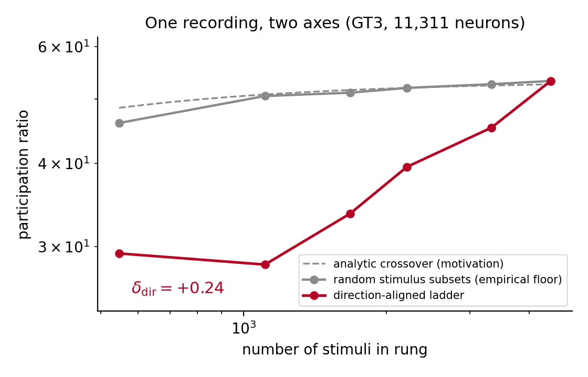
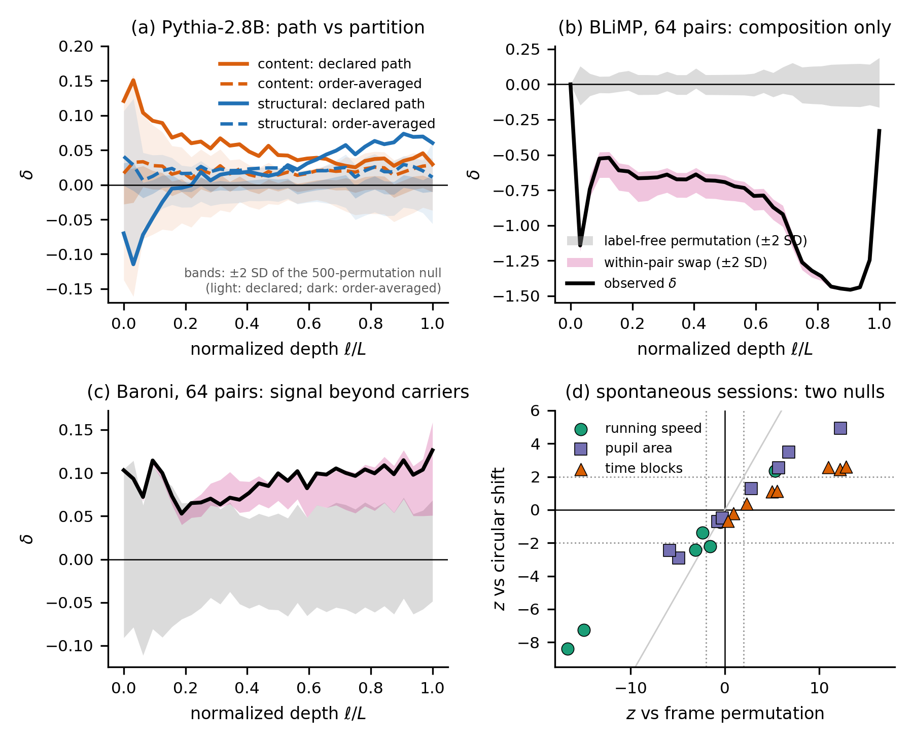

# Structure is in the zoom

**Probing neural symmetry through dimensionality scaling.** Adil Amin, ZEHEN Labs. arXiv 2026
(identifier added on posting). This repository is two things: `theta-zoom`, the measurement
released as a tested tool, and the complete code and data behind every number in the paper.

## The tool

A dimensionality scaling exponent (how the participation ratio grows as you add data) is not
a property of a system: on one ten-thousand-neuron patch of mouse V1 it reads 0.25, 0.31, and
0.35 along three probe axes, and the three numbers mean three different things. `theta-zoom`
decomposes any such exponent exactly into a **label-blind sampling floor** plus a **shift
delta earned against a declared axis** (the classes you accumulate and the order you add them
in), and tests that shift two ways: against an exact label-permutation null, and, when you
tell it what nuisance structure your partition preserves, against a **nuisance-preserving
null** that isolates what the labels add. It runs on any samples-by-features array and on any
Hugging Face language model layer by layer.

### Install and run (sixty seconds)

```bash
pip install -e ".[models]"                       # numpy core; [models] adds torch + transformers
theta-zoom llm --model EleutherAI/pythia-160m --axis axes/ --device mps --out pythia160m.json
theta-zoom plot pythia160m.json --out pythia160m.png
theta-zoom summarize pythia160m.json           # plain-language reading, the paper's rules applied
```

### What it returns, per layer and per axis

- `delta`, `p_two`: the shift along the declared class order and its exact permutation p-value
  (500 permutations by default);
- `delta_orderavg`, `p_two_orderavg`: the shift averaged over random class orders, the
  partition-level statistic for unordered classes;
- `strat_p_two` when a strata file exists: the shift against the nuisance-preserving null, the
  difference between "the labels organize this representation" and "the labels happen to
  preserve composition".

`theta-zoom plot` draws one panel per axis with both statistics against their null bands.
`theta-zoom summarize` applies the paper's reading rules: certification under
Benjamini-Hochberg for both statistics, the declared-path shape (embedding sign, peak, zero
crossing), and, with strata, whether the signal is label-linked or composition.



### Use cases

**A neural recording with labels.** Trials x neurons with a stimulus label per trial
(direction, orientation, category), or frames x neurons with a state label (running speed
octiles, pupil, session-time blocks). Pass the session or animal as strata when trials are not
exchangeable across it.

```python
from theta_zoom import zoom
r = zoom(X, labels, n_perm=500)                     # declared order + order-averaged
r = zoom(X, labels, strata=session_ids, n_perm=500) # + nuisance-preserving null
r["delta"], r["p_two"], r["delta_orderavg"], r["p_two_orderavg"], r["strat_p_two"]
```

`theta-zoom data X.npy labels.npy --strata strata.npy --out r.json --plot r.png` is the same from
the shell: the JSON carries every statistic plus both ladders (`pr_obs`, `pr_floor`), the PNG is
the ladder figure (observed against the matched floor, shift and p annotated), and
`theta-zoom summarize r.json` reads it in plain language (sign, certification at the permutation
resolution, order-averaged agreement, and the stratified verdict when strata were given).

**Your own axis from a public dataset.** Any Hugging Face dataset with a text column and a label
column becomes an axis JSON (and, with `--strata-field`, a nuisance sidecar) in one command:

```bash
theta-zoom axis --dataset Rowan/hellaswag --split validation \
  --text-field ctx --label-field activity_label --n-classes 8 --n-per-class 16 --out hs_axis.json
theta-zoom llm --model EleutherAI/pythia-160m --axis hs_axis.json --device mps --out hs.json
```

Classes default to the most frequent labels; pass `--classes` to choose them. The same builder is a
Python function, `build_axis(rows, text_field, label_field, ...)`, for records you already hold.

**Tests.** `pip install -e ".[test]" && pytest -q tests` runs the numpy-only suite: the
decomposition identity, certification on structured labels and its absence on shuffled ones, the
stratified null, the command line end to end, and the axis builder.

**A language model, every layer.** The paper's prompt battery ships in `axes/`: seven declared
eight-class axes of sixteen prompts (world-knowledge domains, sentence-construction types,
ethical concepts, TruthfulQA categories, HellaSwag activities, ARC topics, and a random control),
plus `language_type.strata.json`, a topic map that turns on the second null for the
construction axis. Point `--axis` at the folder or at one file.

**Checkpoint and model sweeps.** Any Hugging Face revision; every JSON has the same shape.

```bash
for r in step1000 step4000 step16000 step64000 step143000; do
  theta-zoom llm --model EleutherAI/pythia-410m-deduped --revision $r \
      --axis axes/language_type.json --device mps --out lt_410m_$r.json
done
```

`--paper-seeds` reproduces the paper's Table 5 cells to the last digit (max |CLI - artifact| = 0).

**Your own axes.** An axis is a JSON file `{class_name: [prompt, ...]}`. Six or more classes,
sixteen or more prompts each, prompts within a class coherent in structure and varied in
content. Add `<name>.strata.json` with one nuisance label per prompt (topic, template, carrier,
session) and the tool picks it up.

**Python API.** `llm_battery("EleutherAI/pythia-160m", ["axes/"], device="mps", out_path="b.json")`
runs the whole battery; `zoom(...)` is the core.

### What it shows (the paper in six results)

- **Cortex.** The direction-aligned shift is positive in all eight grating recordings and
  exceeds every one of 200 label permutations (p = 1/201 each); it replicates across 167
  Neuropixels populations from 32 mice in a second laboratory and tracks orientation-tuning
  strength (r = +0.41, mixed model p = 3e-7). Where the declared axis is degenerate the
  instrument screens candidate axes and finds session time, spatial frequency, and behavioral
  state.
- **Symmetry.** The working axis follows the code's approximate O(2) symmetry. The eight-class
  harmonic decomposition of the class-mean correlation is exact; full-field gratings are
  quadrupole-dominant (orientation), localized gratings dipole-dominant (direction) because
  single neurons become more direction-selective, and the balance is additive over neurons,
  invariant under random coarse-graining, and steered by label-aware coarse-graining
  (orientation-sorted blocks amplify the quadrupole: the Z2 quotient at the mesoscale).
- **Ground truth.** Ising and nematic lattices and a rotation-equivariant CNN fix the sign:
  conditioning on a scalar order parameter removes dimensions, accumulating a group orbit adds
  them, architectural invariance gives exactly zero; the measured harmonics predicted the
  network's ordering in advance at two of three depths.
- **Language models.** Across six model families the instrument separates content axes
  inherited from tokens from construction axes built along the declared path; label linkage
  is certified at nearly every depth under the order-free statistic, while the profile shape
  belongs to the class arrangement. A pre-registered alignment probe fails informatively:
  instruction tuning does not measurably reorganize moral-category covariance at 0.5-1B on two
  taxonomies. The kernel-harmonic additivity and the blocking flow replicate on Pythia-160m's
  planted axes; a prepended neutral context does not move them.
- **Two null levels.** A nonzero shift means the partition changes covariance accumulation
  relative to its declared null; reading it as representation of the label needs a null that
  preserves nuisance composition. On BLiMP minimal pairs a |z| near 20 vanished under that null.
- **Predictions.** A size ladder at fixed contrast should move the dipole/quadrupole balance
  monotonically; mesoscale signals in orientation-columnar cortex should be
  quadrupole-amplified relative to their single units, cortex with direction maps should keep
  the mesoscale dipole.



### Using it right

1. **Declare before you look.** Classes, class count, and accumulation order are fixed first.
2. **Six or more classes.** Two-class designs fit a slope through two points.
3. **For unordered classes, read the order-averaged shift.** The declared-path profile is a
   property of one path through the classes.
4. **Pass your nuisance structure as strata.** If the shift survives the within-stratum
   permutation, the label is doing work.
5. **Counts are descriptive; profile statistics are inferential.** Expect about 1.7 false
   positives per 33 uncorrected layers.
6. **Coherence beats prompt count.** Prompts that widen within-class topic diversity weaken
   structural axes.

## What is where

```
theta_zoom.py            the instrument: zoom(), llm_battery(), and the theta-zoom CLI
                         (data | llm | plot | summarize); numpy core, optional torch+transformers
render_all.py            prints the paper's tables and headline numbers from the artifacts
axes/                    the prompt battery (7 axes x 8 classes x 16 prompts) + strata sidecar
scripts_canonical/       one script per registered run; the docstring is the registration
                         (expectations written before the run) and names the artifact it writes
   run1..run47_*.py      the numbered runs cited in the paper
   accumulation_order.py, shuffle_label_control.py, allen_*.py, ising_*.py, nematic_*.py
   multipole_harmonics_8dir.py, local_vs_fullfield_tuning.py, sector_balance_scale.py,
   llm_sector_blocking.py     the harmonic-sector analyses (Sec 4, App I)
   make_fig1_2_ladder.py, make_fig3_4_allen_multipole.py, make_fig8_sector_flow.py,
   make_fig5_mechanism.py, make_fig6_llm.py, make_fig7_nulls.py,
   make_fig9_stimulus_sector.py   regenerate the nine figures from the artifacts (script
                         numbers predate the S75 renumbering: make_fig8 draws paper Figure 4,
                         make_fig3_4 draws Figures 3 and 5, make_fig5/6/7 draw Figures 6, 7, 8,
                         make_fig9 draws Figure 9 in the appendix)
   run51_spatial_blocking.py   anatomical (spatial k-means) blocking on all eight recordings
   run52_blocking_factor_check.py, run52b_identity_equal_blocks.py   the blocking factor B(K) and its identity
data_canonical/          the result JSONs (one per script) that every reported number traces to
figures_canonical/       the nine figures in the paper
pyproject.toml           pip install -e . gives the theta-zoom command
```

Raw neural data are public (Stringer et al. figshare releases; Allen Brain Observatory
Neuropixels) and are not included; the scripts that read them expect the paths documented in
their docstrings. Folder names mirror the scripts' relative paths so every script runs
unmodified from a clone.

## Reproduce every number

```bash
python render_all.py
```

### Claim -> artifact -> script

| Claim | Artifact | Script |
|---|---|---|
| V1 direction-aligned shifts, shuffle control | (repo: stringer decomposition JSONs) | shuffle_label_control.py |
| Ladder-design robustness (32/32 cells) | run8_ladder_robustness.json | run8_ladder_robustness.py |
| Accumulation-order reversal (8/8) | antipodal_order.json | accumulation_order.py |
| Allen mixed model + partials | run1_allen_partial_mixed.json | run1_allen_partial_mixed.py |
| Allen split-half cross-fit | s69_allen_crossfit.json | allen_crossfit.py |
| Calibrated model bracket (5 seeds) | run2b_corotating_seeds.json | run2b_corotating_seeds.py |
| Alignment-calibrated prediction (fresh draw) | run11b_fresh_draw_prediction.json | run11_bootstrap_prediction.py |
| pi-periodic alignment + residualized control | run9_alignment_225.json, run3b_principal_angles_residualized.json | run9_alignment_225.py, run3b_principal_angles_residualized.py |
| Transport test (no common rotation) | run7_transport_test.json | run7_transport_test.py |
| Ising / nematic lattices | ising_L128_tc.json, nematic_polar_delta.json | ising_L128_tc.py, nematic_polar_delta.py |
| CNN double dissociation (5 seeds) | run5b_cnn_seeds.json | run5b_cnn_seeds.py |
| CNN sector content + stimulus baseline | run5c_cnn_multipole_fixed.json, run14_stimulus_baseline.json | run5c_cnn_multipole_fixed.py |
| CNN prospective ordering | run12_cnn_ordering.json | run12_cnn_ordering.py |
| V1 label-permutation exact test (16/16, p=1/201) | run38_v1_label_permutations.json | run38_v1_label_permutations.py |
| LLM 500-permutation nulls + order-averaged shift (6 models, 3 axes) | run37_inferential_nulls.json | run37_inferential_nulls.py (+37b/37c wrappers) |
| Allen A_even/A_odd direct mixed model | run39_allen_aeven_mixed.json | run39_allen_aeven_mixed.py |
| Spont state axes, permutation + circular-shift nulls | run40_spont_state_axis.json | run40_spont_state_axis.py |
| CNN ordering per-seed paired stats | run41_cnn_ordering_perseed.json | run41_cnn_ordering_perseed.py |
| BLiMP native stratified floor (within-pair swaps) | run42_blimp_battery.json | run42_blimp_battery.py |
| Baroni complexity contrasts, 16 and 64 pairs | run43_baroni_complexity.json, run43b_baroni_64pairs.json | run43_baroni_complexity.py, run43b_baroni_64pairs.py |
| Base-instruct ethical comparison (two pairs) | run44_base_instruct_ethical.json | run44_base_instruct_ethical.py |
| Topic-stratified floor for the construction axis | run45_lt_stratified_floor.json | run45_lt_stratified_floor.py |
| LLM battery, Pythia 160m/410m/1B/2.8B | run17/18/19/26_*.json | run17/18/19/26_*.py |
| LLM robustness (prompt/order/pooling) | run20_robustness_battery.json | run20_robustness_battery.py |
| Cross-model ranking rho=1.0, slope law | run22_cross_prediction.json | run22_cross_prediction.py |
| Prompt-diversity dilution + OLMo 32/class | run23_expanded_prompts.json | run23_expanded_prompts.py |
| Kernel eff-rank diagnostic | run24_kernel_analysis.json | (inline; JSON committed) |
| OLMo-1B matched 16/class battery | run25_olmo1b_16pc_battery.json | run25_olmo1b_16pc_battery.py |
| Static-session axis search (discovery mode) | run27_static_axis_search.json | run27_static_axis_search.py |
| Planted-C8 axes (compass/clock) | run28_cyclic_axis_llm.json | run28_cyclic_axis_llm.py |
| Figures 5-6 | (generated from JSONs above) | make_fig5_mechanism.py, make_fig6_llm.py |
| Exact 8-direction harmonic decomposition of C(dphi), every recording (Sec 4, App I) | multipole_harmonics_8dir.json | multipole_harmonics_8dir.py |
| Why localized gratings are dipole-dominant: per-neuron OSI/DSI, cardinal test, spatial clustering, coverage terciles | local_vs_fullfield_tuning.json | local_vs_fullfield_tuning.py |
| Sector balance across scales: additivity, coarse-graining flow, Allen per-area | sector_balance_scale.json | sector_balance_scale.py |
| LLM analogue: kernel-harmonic additivity, unit blocking, context-length knob (Pythia-160m) | llm_sector_blocking.json | llm_sector_blocking.py |
| Calibrated-model overshoot across recordings (registered miss: under-predicts GT1/GT2, overshoots GT3) | run48_overshoot_across_recordings.json | run48_overshoot_across_recordings.py |
| Split-half control for the sorted-blocking flow | run49_blocking_splithalf.json | run49_blocking_splithalf.py |
| Graining delta(K) and Chun agreement on all eight recordings | run50_perrecording_anchors.json | run50_perrecording_anchors.py |
| Sector-resolved graining (orientation-, direction-sorted, random blocks) on all eight recordings (App E table) | run50b_graining_sectors.json | run50b_graining_sectors.py |
| Two-key (footprint x phase) blocking test of the App E explanation (registered miss) | run50c_twokey_blocking.json | run50c_twokey_blocking.py |
| Anatomical (spatial k-means) blocking on all eight recordings: the intermediate point of the correlation-length hypothesis (Sec 4.1, App E) | run51_spatial_blocking.json | run51_spatial_blocking.py |
| Blocking factor B(K): within-block products rho_1, rho_2 per blocking scheme; raw vs correlation-profile flow (Sec 4.1, App I) | run52_blocking_factor_check.json | run52_blocking_factor_check.py |
| Blocking identity on equal-size blocks (to 1e-16) | run52b_identity_equal_blocks.json | run52b_identity_equal_blocks.py |
| Figures 1-3 and 5 | (generated from JSONs above) | make_fig1_2_ladder.py, make_fig3_4_allen_multipole.py |
| Figure 4 (sector balance across scales) | sector_balance_scale.json, run50b_graining_sectors.json, run51_spatial_blocking.json, allen_expansion_all_sessions.json | make_fig8_sector_flow.py |
| Figures 6-8 | (generated from JSONs above) | make_fig5_mechanism.py, make_fig6_llm.py, make_fig7_nulls.py |
| Figure 9 (sector balance against single-neuron tuning by stimulus type, App I) | local_vs_fullfield_tuning.json | make_fig9_stimulus_sector.py |

## Citation

```bibtex
@article{amin2026zoom,
  author  = {Amin, Adil},
  title   = {Structure is in the zoom: probing neural symmetry through
             dimensionality scaling},
  journal = {arXiv preprint},
  year    = {2026},
  note    = {Code and data: https://github.com/adilamin89/structure-in-the-zoom}
}
```

## License

Code: MIT (see `LICENSE`). Result artifacts in `data_canonical/` may be reused with
attribution to the paper. Prompts and stimuli carry their own terms: the three axes composed for the
paper are CC BY 4.0; the benchmark-derived axes and stored stimuli inherit their sources' licenses
(TruthfulQA Apache-2.0, HellaSwag MIT, ARC CC BY-SA 4.0, ETHICS MIT, BLiMP CC BY 4.0, Baroni et al.
per their release). Origins, authorship (including language-model assistance in drafting the composed
axes) and licenses are listed item by item in `axes/PROVENANCE.md`.
