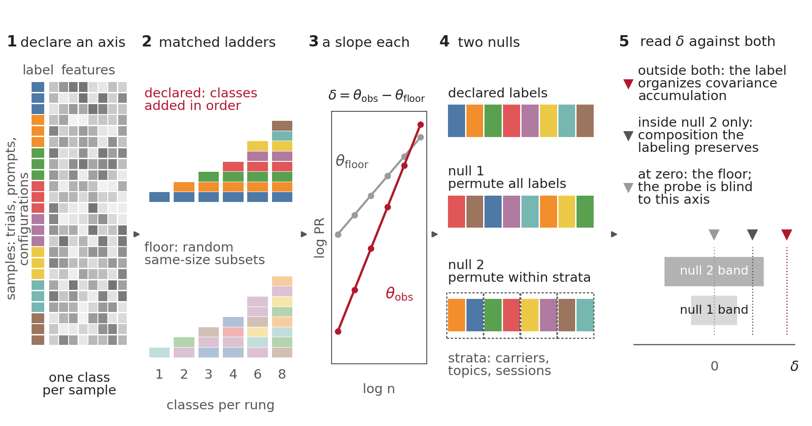

# Structure is in the zoom

**Probing neural symmetry through dimensionality scaling.** Adil Amin, ZEHEN Labs, 2026 (arXiv
identifier added on posting). This repository is two things: `rung`, the paper's measurement
released as a tested tool, and the code and data behind every number in the paper.



## What rung reads

A dimensionality-scaling exponent, the slope of the participation ratio against subsample size on
log-log axes, is reported for neural populations and for the layers of language models as if the
number belonged to the system. It does not. On one patch of eleven thousand mouse V1 neurons the
exponent reads 0.25 along random stimulus subsets, 0.31 along drift direction and 0.35 along
neuron count, and only the middle number carries structure. `rung` splits any such exponent
exactly into a **floor**, what random subsets of the same sizes return through the same estimator,
and a **shift** δ earned along a **declared axis**, the classes you accumulate and the order you add
them in; it then reads the shift against two nulls: **permuting the labels** at fixed rung sizes,
which asks whether the axis is linked to the covariance at all, and **permuting them only within
nuisance strata** (carrier sentences, topics, sessions), which asks whether the label adds anything
beyond the composition the labeling preserves. A shift outside both bands means the label organizes
covariance accumulation; inside the second band only, it is composition; at zero, the probe is blind
to this axis, which is not the same as the population lacking structure.

It runs on any samples-by-features array with one label per row, and on any Hugging Face language
model at every layer from one command. A rung is one step of the subsampling ladder; the tool reads
every rung against its matched floor. There is no probe to train and no dictionary to fit.

## Install and run in sixty seconds

```bash
pip install git+https://github.com/adilamin89/structure-in-the-zoom     # numpy core
rung data X.npy labels.npy --out r.json --plot r.png                     # any samples-by-features array; labels = integer class ids, one per row
rung summarize r.json                                                    # the reading, in plain language
```

For a language model, clone the repository (the paper's prompt axes live in `axes/`) and add the
model extras:

```bash
git clone https://github.com/adilamin89/structure-in-the-zoom && cd structure-in-the-zoom
pip install -e ".[models]"                                    # + torch, transformers, datasets
rung llm --model EleutherAI/pythia-160m --axis axes/language_type.json --device mps --out lt.json   # --device cpu | mps | cuda
rung plot lt.json --out lt.png                                # the depth profile with both null bands
rung summarize lt.json                                        # the reading, layer by layer
```

`theta-zoom`, the tool's name through 1.1.0, stays as an alias for one release.

## What it returns

For one array and one axis (`rung data`, or `zoom(X, labels)` in Python):

- `theta_floor`, `delta`: the floor and the shift, with `theta_obs = theta_floor + delta` exact;
- `p_two`, `z`: the shift against the label-permutation null (500 permutations by default);
- `delta_orderavg`, `p_two_orderavg`: the shift averaged over fifty random class orders, the statistic
  for a partition whose classes have no natural order;
- `strat_p_two` when strata are given: the shift against the nuisance-preserving null;
- the ladder itself: `pr_obs` and `pr_floor` at every rung, `deficit` (the log participation ratio
  of the accumulated classes below the floor, zero at the top rung) and `late_fraction`, the share of
  the climb that the second half of the classes still carries. With `--antipode pairs.json`
  (`{class: its antipodal class}`) `late_fraction` is the stall test of the paper's Section 7: a code that
  has every class mean by half the classes has nothing left to climb there; a code that distinguishes
  a class from its antipode still does.

Before any of that, `rung data` prints the **spectrum**: the array's full effective dimension, the
variance fraction of its leading eigenvalue and of its largest single feature. A population dominated
by one direction blinds any spectral functional (the paper's Section 8.3 meets one); `--standardize`
z-scores every feature first and is the repair.

Three further readings, each one flag:

- `--decompose` (`decompose(X, labels)`): the exact four-term split of every rung's deficit and of the
  shift into a trace term, a fluctuation-pooling term, a between-class term and a mean-fluctuation
  coupling (Section 7), regrouped into two scale-free pieces, the change in the pooled within-class
  effective dimension `D` and the trace share of the class means `Tb`, with the private slope of `D`
  against log(k/K) (1 when every class brings its own fluctuation subspace, 0 when the variability
  recurs across classes) and, with `--n-shuffle`, every term net of label permutations. Read `D` and
  `Tb` wherever the within-class scale changes with the class.
- `--sectors` (`sectors(X, labels)`): for a cyclic axis, with the labels in cyclic order, the harmonics
  of the class-mean kernel (Section 4): the coefficients (for eight classes the paper's a, c1, b2, c3, b4), the sector balance
  b2/|c1|, the even and odd amplitudes, the coherence of adjacent and of antipodal classes, and the
  accumulation order that entry coherence predicts will climb faster.
- `--null-shift`: when the labels are in time order (one per frame), a circular shift of the whole
  label sequence as the second null, which keeps the labels' autocorrelation and breaks only their
  alignment with the frames (Section 3). A slowly drifting population passes the label permutation
  and fails this one.

`--order sequential|antipodal|<list>` sets the declared accumulation order (the paper's Section 4.1
contrast); `--split-by scores.npy` runs the top, bottom and a random third of the features at matched
size, each with its own floor. For a model, every quantity above is returned at every layer, and
`--revision` reads any Hugging Face checkpoint.

`rung summarize` turns a result into sentences under the paper's rules: the sign and its standing at
the permutation resolution, whether the order-averaged statistic agrees with the declared order, the
stratified verdict, the per-rung deficit and the late fraction, the split, the sector balance, and,
for a model, the profile shape (embedding sign, valley, last zero crossing) and whether the signal is
label-linked or composition. `rung plot` draws the ladder figure for an array and one panel per axis
for a model, with both null bands.

## Two worked examples

**A recording.** Trials by neurons (from an NWB file, build the trials-by-units count matrix with `pynwb`
and save it as `.npy`; from `.mat`, `scipy.io.loadmat`), one drift direction per trial in eight classes at
45°, in angular order, with the antipodal pairs written down.

```bash
python -c "import json; json.dump({c: (c + 4) % 8 for c in range(8)}, open('pairs.json', 'w'))"
rung data resp.npy direction.npy --antipode pairs.json --sectors --decompose --out v1.json --plot v1.png
rung summarize v1.json
```

The summary gives the floor, the shift and its permutation p; the deficit at every rung and the share
of the climb left after four classes, read as the stall test; the sector balance of the class-mean
kernel with the accumulation order it predicts; and the split, which says whether the shift is the
pooling of fluctuation modes private to each class (`D`, the paper's finding on V1) or the class means
(`Tb`). Pass the session or animal as `--strata` when trials are not exchangeable across it; pass a
per-neuron direction-selectivity index as `--split-by` to compare the direction-selective, random and
orientation-only thirds at matched size.

**A model.** An axis is a JSON file `{"class": ["prompt", ...], ...}`; sixteen prompts per class, eight
classes, the hidden state at the last token of every layer. `--paper-seeds` reproduces the paper's table cells.

```bash
rung llm --model EleutherAI/pythia-2.8b --axis axes/language_type.json axes/world_knowledge.json \
    --device mps --out p28.json
rung summarize p28.json
```

The construction axis (sentence types, topics mixed inside each class) starts negative at the
embedding and rises to positive with depth; the content axis (world-knowledge domains) is positive at
the embedding and dilutes. `axes/language_type.strata.json` carries a topic per prompt, so the
construction axis is read against the second null as well. For checkpoints, add `--revision`
(`step1000`, `step143000`); for a site other than the residual stream, collect one feature vector per
prompt at that site (an attention head's output, an MLP's neurons, a sparse autoencoder's latents) and
call `zoom(X, labels)` on it. `rung axis --dataset ... --text-field ... --label-field ... --out my.json`
builds an axis from any Hugging Face dataset, with `--strata-field` for the nuisance sidecar.

The two planted axes in `axes/`, `compass.json` and `clock.json`, are what the second null is for:
eight class tokens rotated inside sixteen shared carrier sentences. Under the ordinary floor both read
δ ≈ −0.2 at every layer with no label information at the embedding; the carrier-stratified null (their
`.strata.json` sidecars) returns them to zero.

## Reading the numbers

1. **Declare before you look.** Classes, class count and accumulation order are fixed first.
2. **Six or more classes, ten or more samples per rung.** A two-class ladder fits a slope through two
   points, and a rung with fewer than ten samples is skipped.
3. **For unordered classes, read the order-averaged shift.** The declared-order profile is a property
   of one path through the classes; the crossover shape of a depth profile belongs to the path.
4. **Pass your nuisance structure as strata.** If the shift survives the within-stratum permutation,
   the label is doing work; if the stratified null absorbs it, the signal is composition.
5. **Read the spectrum first**, and standardize when one direction dominates.
6. **Compare subsets at matched size only.** The shift depends on the number of features.
7. **Read `D` and `Tb`, not the raw pooling and trace terms,** wherever the within-class scale changes
   with the class (a language model's construction classes tighten with depth).
8. **For a depth profile, the inference is on the profile**, the integrated excess of the shift over
   its embedding value against the permutation null, not on a count of significant layers.
9. **Coherence beats prompt count.** Prompts that widen within-class topic diversity weaken
   construction axes.

## What it does not ship

The blocking factor B(K) and sorted coarse-graining (they need a tuning phase per unit; the scripts
that compute them on the paper's recordings are in `scripts_canonical/`), the calibrated and the
cell-built population models of Section 7, and the lattice samplers of Section 6. Those are scripts,
not commands.

## Extending it

Everything the paper measures goes through one function, `zoom(X, labels, strata=None)`, and the pieces
you would change are small and named.

- **A new null** is a rule for relabeling at fixed rung sizes: a loop that draws relabelings and
  re-runs the observed ladder against the shared floor. The circular-shift null is the template.
- **A nonlinear estimator.** `zoom()` builds one Gram matrix and every rung is `_subset_pr(K, idx)`, the
  centered Gram-trace participation ratio of that subset. A kernel PR is the same call on a kernel
  matrix; a local intrinsic dimension replaces `_subset_pr` with a function of the subset rows. The
  identity `theta_obs = theta_floor + delta` holds for any functional evaluated on both arms; the
  paper's sign rule and ordering rule are established for the linear one.
- **Other modalities.** `rung data` reads `.npy`, `.csv` and whitespace text. For NWB files build the
  trials-by-units count matrix with `pynwb` and save it as `.npy`; for `.mat`, `scipy.io.loadmat`. A
  vision model is the model door with a different encoder: one feature vector per image at each layer,
  then `zoom(X, labels)` per layer with the image-level nuisance as strata.
- **Multi-token probes.** `llm_battery` reads the last-token hidden state; a mean over a span or a
  specific position is a one-line change there (the paper's mean-pooling result is the reference
  point: the construction axis collapses, the content axis survives).

Tests are numpy-only and run in ten seconds (`pip install -e ".[test]" && pytest -q tests`); add one
per extension.

## The paper in six results

- **Cortex.** The direction-aligned shift is positive in eight of eight grating recordings and exceeds
  every one of 200 label permutations; it is positive in 32 of 32 animals in a second laboratory and
  tracks the even-sector amplitude of the class-mean kernel across 167 populations. Where the declared
  axis is degenerate the instrument screens candidate axes and finds session time, spatial frequency
  and behavioral state.
- **Symmetry.** The grating axis works because it runs along the code's O(2) symmetry. The eight-class
  harmonic decomposition of the class-mean kernel is exact; full-field gratings are quadrupole-dominant
  (orientation), localized gratings dipole-dominant (direction) because single neurons become more
  direction-selective. The even sector sets the rungs up to four classes and the odd sector, carried by
  the direction-selective neurons, the rungs beyond: the orientation-only third of the neurons has
  nothing left to climb after four classes, the direction-selective third has most of its climb ahead,
  and the shift's variation across recordings is the direction-selective fraction. Adjacent classes
  are more coherent than antipodal ones, so the sequential accumulation order climbs faster (entry
  coherence), and under coarse-graining the sector balance flows by a closed-form blocking factor
  B(K) = [1/K + (1 − 1/K)ρ₂] / [1/K + (1 − 1/K)ρ₁]; mouse anatomy sits at its random limit.
- **Ground truth.** Ising and nematic lattices and a rotation-equivariant network fix the sign:
  conditioning on a scalar order parameter removes dimensions, accumulating a group orbit adds them,
  architectural invariance gives exactly zero; entry coherence predicts the network's reversed
  accumulation order, found at five of five seeds in its early layers.
- **The anatomy of the shift.** Split on the covariance itself, the shift is the pooling of fluctuation
  modes private to each direction, each a co-fluctuation of the neurons that fire at that direction with
  its weight on the most active hundred of them.
- **Language models.** On nine models across five architectures the instrument separates content axes
  inherited from the tokens (positive at the embedding, diluting with depth) from construction axes
  built with depth (negative at the embedding, rising past the null); the shape recurs, the depth at
  which the construction profile turns is the architecture's constant. A moral-concept axis reads zero
  on every base model tested, before and after instruction tuning.
- **Two nulls.** A nonzero shift means the partition changes covariance accumulation relative to its
  declared null; reading it as representation of the label needs a null that preserves the nuisance
  the partition preserves. On BLiMP minimal pairs a grammaticality signal of twenty standard deviations
  is entirely carrier composition.

## What is where

```
rung.py                  the instrument: zoom(), decompose(), sectors(), llm_battery(), build_axis(),
                         and the rung command line (data | llm | axis | plot | summarize); numpy core,
                         torch and transformers only for the model door
theta_zoom.py            alias of rung (the name through 1.1.0), kept for one release
tests/                   numpy-only pytest suite: the decomposition identity, significance on structured
                         labels and its absence on shuffled ones, the stratified null, the deficit ladder
                         and the stall test, the split at matched size, the sector fit on a planted
                         kernel, the declared orders, the circular-shift null, the command line end to end
render_all.py            prints the paper's tables and headline numbers from the artifacts
axes/                    every prompt in the paper: the six battery axes and a random control, the ETHICS
                         benchmark axis, the compass and clock axes, with strata sidecars; PROVENANCE.md
                         gives origin and license per file
scripts_canonical/       one script per analysis, named for what it computes; each docstring names the
                         artifact it writes. make_fig_*.py regenerate the paper's figures from the artifacts.
data_canonical/          the result JSON behind every reported number (one per script)
figures_canonical/       the paper's figures
pyproject.toml           pip install -e . gives the rung command (and theta-zoom as an alias)
```

Raw neural data are public (Stringer et al. figshare releases; Allen Brain Observatory Neuropixels)
and are not included; the scripts that read them expect the paths documented in their docstrings.
`python render_all.py` prints every table and headline number from the artifacts in `data_canonical/`.

### Claim, artifact, script

| Paper | Claim | Artifact | Script |
|---|---|---|---|
| Sec 3 | Direction-aligned shifts, 8 of 8, with the label permutation | run38_v1_label_permutations.json | run38_v1_label_permutations.py, shuffle_label_control.py |
| Sec 3 | Ladder-design variants (32 of 32 cells) | run8_ladder_robustness.json | run8_ladder_robustness.py |
| Sec 3 | The axis search on static and natural-image sessions | run27_static_axis_search.json | run27_static_axis_search.py |
| Sec 3 | The state axes with the permutation and circular-shift nulls | run40_spont_state_axis.json | run40_spont_state_axis.py |
| Sec 4 | The harmonic content of the class-mean kernel, every recording | multipole_harmonics_8dir.json, cos2theta_fit.json | multipole_harmonics_8dir.py |
| Sec 4.1 | The accumulation-order contrast (8 of 8) | antipodal_order.json | accumulation_order.py |
| Sec 4.2 | The sector balance under blocking, the blocking factor and its identity | sector_balance_scale.json, run50b_graining_sectors.json, run52_blocking_factor_check.json, run52b_identity_equal_blocks.json | sector_balance_scale.py, run52_blocking_factor_check.py, run52b_identity_equal_blocks.py |
| Sec 4.2 | Anatomical (spatial k-means) blocks | run51_spatial_blocking.json | run51_spatial_blocking.py |
| Sec 5 | The second laboratory: 32 sessions, 167 populations | allen_expansion_all_sessions.json | allen_expansion.py |
| Sec 5 | The even-sector correlate: mixed model, partials, split-half cross-fit | run1_allen_partial_mixed.json, run39_allen_aeven_mixed.json, s69_allen_crossfit.json | run1_allen_partial_mixed.py, run39_allen_aeven_mixed.py, allen_crossfit.py |
| Sec 6.1 | Ising and nematic lattices; the two-species lattice | ising_L128_tc.json, nematic_polar_delta.json, run62_two_species_xy.json | ising_L128_tc.py, nematic_polar_delta.py, run62_two_species_xy.py |
| Sec 6.2 | The equivariant network: the invariant zero, the sector content, the reversed order | run5b_cnn_seeds.json, run5c_cnn_multipole_fixed.json, run14_stimulus_baseline.json, run12_cnn_ordering.json, run41_cnn_ordering_perseed.json | run5b_cnn_seeds.py, run5c_cnn_multipole_fixed.py, run14_stimulus_baseline.py, run12_cnn_ordering.py, run41_cnn_ordering_perseed.py |
| Sec 7 | The calibrated model and its refits across recordings | run2b_corotating_seeds.json, run11b_fresh_draw_prediction.json, run56_odd_gain_across_recordings.json, run57_driven_gain_across_recordings.json, run58_within_class_spectrum_vs_trials.json | run2b_corotating_seeds.py, run11_bootstrap_prediction.py, run56_odd_gain_across_recordings.py, run57_driven_gain_across_recordings.py, run58_within_class_spectrum_vs_trials.py |
| Sec 7 | The direction-selective thirds and the rung-four stall | run59_shift_by_direction_selectivity.json, run59b_per_rung_thirds.json | run59_shift_by_direction_selectivity.py, run59b_per_rung_thirds.py |
| Sec 7 | The exact split of the deficit; the private modes in neuron space | run63_deficit_decomposition.json, run64a_within_class_localization.json, run68_v1_scale_and_zscore.json | run63_deficit_decomposition.py, run64a_within_class_localization.py, run68_v1_scale_and_zscore.py |
| Sec 7 | The population model built from the cells | run60_mixture_model.json, run60b_mixture_matchedK_armA.json, run60b_mixture_matchedK_armB.json | run60_mixture_model.py, run60b_mixture_matchedK.py |
| Sec 7 | The split in the network, the second laboratory and the language models | run67_cnn_deficit_decomposition.json, run66_allen_deficit_decomposition.json, run65_pythia_deficit_decomposition.json (+ 410m/1B) | run67_cnn_deficit_decomposition.py, run66_allen_deficit_decomposition_modal.py, run65_pythia_deficit_decomposition.py |
| Sec 7 | The within-class subspace alignment, its controls, the transport test | run9_alignment_225.json, run3b_principal_angles_residualized.json, run7_transport_test.json | run9_alignment_225.py, run3b_principal_angles_residualized.py, run7_transport_test.py |
| Sec 8.1–8.2 | The battery at four Pythia scales; the permutation and order-averaged nulls | run17/18/19/26 battery JSONs, run37_inferential_nulls.json | run17/18/19/26 battery scripts, run37_inferential_nulls.py |
| Sec 8.2 | The controls on the rise: scrambling, topic strata, pooling, prompt count | run20_robustness_battery.json, run45_lt_stratified_floor.json, run23_expanded_prompts.json | run20_robustness_battery.py, run45_lt_stratified_floor.py, run23_expanded_prompts.py |
| Sec 8.2 | The moral-concept axis, base and instruct | run44_base_instruct_ethical.json | run44_base_instruct_ethical.py |
| Sec 8.3 | The architectures: GPT-Neo, RedPajama-INCITE, Mamba, OLMo-2; the ranking across scales | run47_fourth_cell_redpajama.json, run53_mamba_fifth_cell.json, run54_olmo2_1b_construction.json, run22_cross_prediction.json | run47_fourth_cell_redpajama.py, run53_mamba_fifth_cell.py, run54_olmo2_1b_construction.py, run22_cross_prediction.py |
| Sec 8.3 | The blind probe and its repair | run55_blind_probe_physics.json, run25_olmo1b_16pc_battery.json | run55_blind_probe_physics.py, run25_olmo1b_16pc_battery.py |
| Sec 8.4 | The planted axes and the carrier-stratified floor | run28_cyclic_axis_llm.json | run28_cyclic_axis_llm.py |
| Sec 8.4 | BLiMP and the Baroni contrasts at 16 and 64 pairs | run42_blimp_battery.json, run43_baroni_complexity.json, run43b_baroni_64pairs.json | run42_blimp_battery.py, run43_baroni_complexity.py, run43b_baroni_64pairs.py |
| App A | The random-stimulus zero on all 18 recordings | (per-recording decomposition JSONs) | random_zoom_all_recordings.py |
| App C | The spatial neuron ladder and its exchangeable control | (per-recording JSONs) | exchangeable_neuron_zoom.py, allen_neuron_zoom.py |
| App J | The single-neuron tuning by stimulus type | local_vs_fullfield_tuning.json | local_vs_fullfield_tuning.py |
| App K | The floor formula against simulation | (eq1_validation output) | eq1_validation.py, chun_comparison.py |

## Citation

```bibtex
@article{amin2026zoom,
  author  = {Amin, Adil},
  title   = {Structure is in the zoom: probing neural symmetry through
             dimensionality scaling},
  journal = {arXiv preprint},
  year    = {2026},
  note    = {Code and data: https://github.com/adilamin89/structure-in-the-zoom}
}
```

## License

Code: MIT (see `LICENSE`). Result artifacts in `data_canonical/` may be reused with attribution to the
paper. Prompts and stimuli carry their own terms: the three axes composed for the paper are CC BY 4.0;
the benchmark-derived axes and stored stimuli inherit their sources' licenses (TruthfulQA Apache-2.0,
HellaSwag MIT, ARC CC BY-SA 4.0, ETHICS MIT, BLiMP CC BY 4.0, Baroni et al. per their release). Origins,
authorship and licenses are listed item by item in `axes/PROVENANCE.md`.
